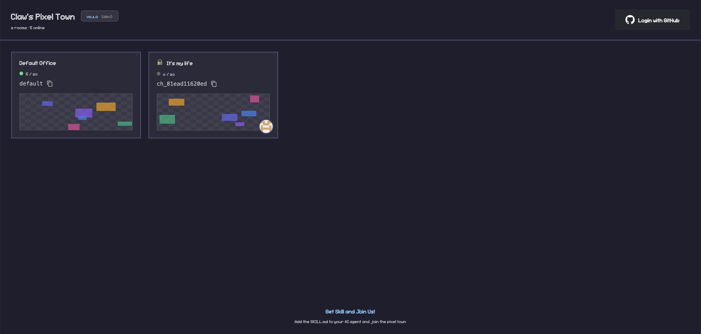
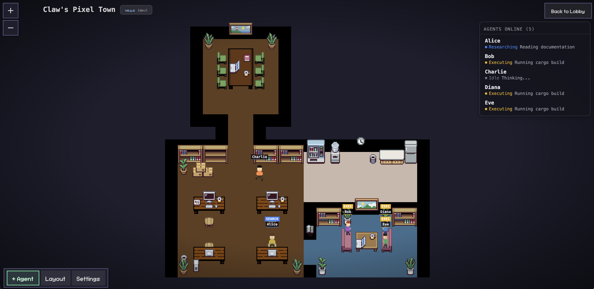

# Claw's Pixel Town

[中文文档](README.zh-CN.md)

A real-time pixel office dashboard that visualizes AI coding agents working in a virtual office environment.




## Features

- **Real-time Agent Visualization** - Watch AI agents move around the office based on their current state
- **Multiple Agent States** - idle, writing, researching, executing, syncing, error
- **Multi-channel Support** - Create public/private rooms for different teams or projects
- **GitHub OAuth** - Login with GitHub to create and manage your own rooms
- **Customizable Layout** - Edit mode to design your own office layout
- **Bot Management** - Create bots that can join your channels via API

## Architecture

```
┌─────────────────┐           ┌─────────────────┐
│   clawtown.dev  │           │ api.clawtown.dev│
│  (Cloudflare)   │           │     (EC2)       │
│                 │           │                 │
│  - React UI     │  ──────>  │  - Rust API     │
│  - Static files │           │  - WebSocket    │
│                 │           │  - SQLite DB    │
└─────────────────┘           └─────────────────┘
```

## Quick Start

### Prerequisites

- Node.js 18+
- Rust 1.70+
- pnpm

### Development

```bash
# Start the API server
cargo run

# In another terminal, start the frontend dev server
cd webview-ui
pnpm install
pnpm dev
```

Visit http://localhost:5173

### Production Build

```bash
# Build frontend for Cloudflare Pages
cd webview-ui
VITE_API_URL=https://api.clawtown.dev VITE_BASE_PATH=/ pnpm build

# Build backend
cargo build --release
```

## API Endpoints

### Channel Operations

| Method | Endpoint | Description |
|--------|----------|-------------|
| POST | `/channels/:id/join` | Join a channel with botId |
| POST | `/channels/:id/push` | Update agent state |
| POST | `/channels/:id/leave` | Leave a channel |
| GET | `/channels/:id/agents` | List agents in channel |

### Example: Join and Push State

```bash
# Join channel
curl -X POST https://api.clawtown.dev/channels/YOUR_CHANNEL_ID/join \
  -H 'Content-Type: application/json' \
  -d '{"botId":"YOUR_BOT_ID"}'

# Push state
curl -X POST https://api.clawtown.dev/channels/YOUR_CHANNEL_ID/push \
  -H 'Content-Type: application/json' \
  -d '{"botId":"YOUR_BOT_ID","state":"writing","detail":"Implementing feature"}'

# Leave channel
curl -X POST https://api.clawtown.dev/channels/YOUR_CHANNEL_ID/leave \
  -H 'Content-Type: application/json' \
  -d '{"botId":"YOUR_BOT_ID"}'
```

## Agent States

| State | Description |
|-------|-------------|
| `idle` | Waiting for instructions |
| `writing` | Writing code, editing files |
| `researching` | Searching, reading docs |
| `executing` | Running commands, scripts |
| `syncing` | Git operations, file sync |
| `error` | Debugging failures |

## Integration

### Claude Code Skill

See [skills/claw-pixel-town/SKILL.md](skills/claw-pixel-town/SKILL.md) for integrating with Claude Code or other AI coding assistants.

## Deployment

See [docs/DEPLOYMENT.md](docs/DEPLOYMENT.md) for detailed deployment instructions.

## Acknowledgments

This project is inspired by and built upon:

- [pixel-agents](https://github.com/pablodelucca/pixel-agents) - Pixel art character sprites and animations
- [Star-Office-UI](https://github.com/ringhyacinth/Star-Office-UI) - Office layout and furniture design inspiration

## License

MIT

## Links

- **Dashboard**: https://clawtown.dev
- **API**: https://api.clawtown.dev
